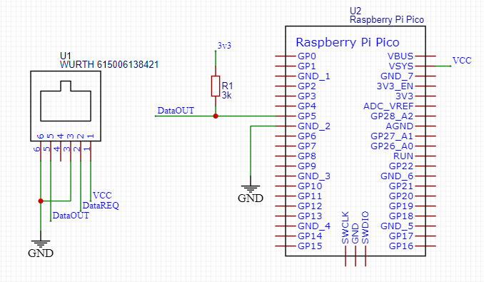
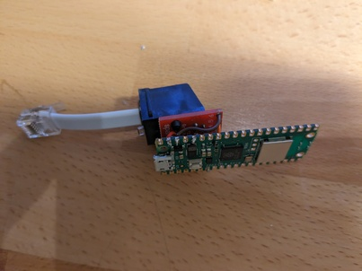
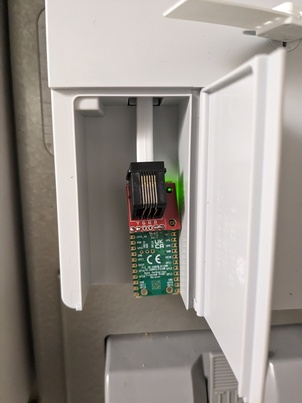

# Ett enkelt sätt att koppla din nya elmätare till en MQTT broker

## Hårdvara
Koppla ihop en 6 pinnars RJ-12 kontakt med picon enligt följande.

| RJ-12   |RJ- 12| RPI |
|---------|------|-----|
| 1 (Vcc) | 2 (dataReq)    | 39 (VSYS) |
| 5 (data out) | | 7 (UART1 Rx)
| 6 (GND) | | 38 (GND)|

Sätt ett pull upp motstånd på omkring 3 Kohm mellan 7 (UART1 Rx) 36 (3,3V) på pico. Allt enligt nedanstående schema (bidrag från @speedbird620)


## Mjukvara
Installationen är automatiserad i Makefile med en deploy regel.
Anslut picon till host samtidigt som BOOTSEL är nedtryckt och kör sedan deploy:

```
per@home:~/fs/data/projects/el-mätare/picowhanport$ time make deploy 
cp flash_nuke.uf2 /run/media/per/RPI-RP2
sleep 15
cp RPI_PICO_W-20240222-v1.22.2.uf2 /run/media/per/RPI-RP2
sleep 5
# upgrade version string so we can follow we run the latest...
before=$(cat main.py | grep ^version | cut -d\" -f2) ;\
sed -i s/^version.*/version\ =\ \"$(($before+1))\"/g main.py
grep ^version main.py
version = "4"
mpremote cp config.py.home :config.py
cp config.py.home :config.py
mpremote cp boot.py simple.py obis.py :
cp boot.py :
cp simple.py :
cp obis.py :
mpremote cp main.py :
cp main.py :
```

## debug hjälpmedel

### mqtt-viewer
Installera paketet "mqttcli" och kör sedan "make mqtt-viewer" så visas de mqtt meddelanden
som picon publicerar :
```
per@home:~/fs/data/projects/el-mätare/picowhanport$ make mqtt-viewer 
sub --auto-reconnect \
        --broker tcp://$(grep MQTTHost config.py.home | cut -d\' -f2):1883 \
        --topic $(grep MQTTTopic config.py.home | cut -d\' -f2)/#
2024/03/28 16:53:00 subscribed: electric-meter/main/#
2024/03/28 16:53:00 connected: tcp://192.168.10.10:1883
2024/03/28 16:53:19 [electric-meter/main/P1mqttID] P1mqtt-e661ac8863429b21
2024/03/28 16:53:19 [electric-meter/main/debug/version] 4
```

### "torrkörning"
Vid programutveckling kan det vara behjälpligt att slippa springa fram och tillbaka
mellan dator och elskåp... då går det att sätta variabeln "unittest" till 1 så läses
från en referens fil istället för från serieporten.

## Installation i elskåpet
koppla in picon till din elmätares HAN port med en rak (altså pin 1 går till pin 1 o.s.v) RJ-12 kabel. LED'en blinkar med omkring 2 Hz medan picon försöker koppla sig till WLAN. När den är uppkopplad lyser den med fast sken men släcks en kort stund för varje gång den får data från elmätaren som skickas till MQTT brokern. Denna släckning skall ske var tionde sekund. Hade det varit en fyr så hade den haft karaktären `Oc 10s`

### exempel på data

```
per@home:~/fs/data/projects/el-mätare/picowhanport$ make mqtt-viewer | tee unit-test/example.mqttlog
sub --auto-reconnect \
        --broker tcp://$(grep MQTTHost config.py.home | cut -d\' -f2):1883 \
        --topic $(grep MQTTTopic config.py.home | cut -d\' -f2)/#
2024/03/28 16:56:01 connected: tcp://192.168.10.10:1883
2024/03/28 16:56:01 subscribed: electric-meter/main/#
2024/03/28 16:57:00 [electric-meter/main/P1mqttID] P1mqtt-e661ac8863429b21
2024/03/28 16:57:00 [electric-meter/main/debug/version] 4
2024/03/28 16:57:01 [electric-meter/main/model] LGF5E360
2024/03/28 16:57:01 [electric-meter/main/1-0:1.8.0] 14697.126
2024/03/28 16:57:01 [electric-meter/main/0-0:1.0.0] 240328165700
2024/03/28 16:57:01 [electric-meter/main/1-0:2.8.0] .056
2024/03/28 16:57:01 [electric-meter/main/1-0:3.8.0] .547
2024/03/28 16:57:01 [electric-meter/main/1-0:4.8.0] 668.432
2024/03/28 16:57:01 [electric-meter/main/1-0:2.7.0] .000
2024/03/28 16:57:01 [electric-meter/main/1-0:3.7.0] .000
2024/03/28 16:57:01 [electric-meter/main/1-0:1.7.0] .869
2024/03/28 16:57:01 [electric-meter/main/1-0:41.7.0] .192
2024/03/28 16:57:01 [electric-meter/main/1-0:22.7.0] .000
2024/03/28 16:57:01 [electric-meter/main/1-0:21.7.0] .278
2024/03/28 16:57:01 [electric-meter/main/1-0:42.7.0] .000
2024/03/28 16:57:01 [electric-meter/main/1-0:4.7.0] .131
2024/03/28 16:57:01 [electric-meter/main/1-0:62.7.0] .000
2024/03/28 16:57:01 [electric-meter/main/1-0:61.7.0] .398
2024/03/28 16:57:01 [electric-meter/main/1-0:23.7.0] .000
2024/03/28 16:57:01 [electric-meter/main/1-0:24.7.0] .057
2024/03/28 16:57:01 [electric-meter/main/1-0:44.7.0] .028
2024/03/28 16:57:01 [electric-meter/main/1-0:43.7.0] .000
2024/03/28 16:57:01 [electric-meter/main/1-0:63.7.0] .000
2024/03/28 16:57:01 [electric-meter/main/1-0:64.7.0] .046
2024/03/28 16:57:01 [electric-meter/main/1-0:52.7.0] 226.4
2024/03/28 16:57:01 [electric-meter/main/1-0:32.7.0] 226.5
2024/03/28 16:57:01 [electric-meter/main/1-0:31.7.0] 1.2
2024/03/28 16:57:01 [electric-meter/main/1-0:72.7.0] 226.1
2024/03/28 16:57:01 [electric-meter/main/1-0:51.7.0] .8
2024/03/28 16:57:01 [electric-meter/main/1-0:71.7.0] 1.7
2024/03/28 16:57:11 [electric-meter/main/0-0:1.0.0] 240328165710
2024/03/28 16:57:11 [electric-meter/main/1-0:4.8.0] 668.433
2024/03/28 16:57:11 [electric-meter/main/1-0:1.8.0] 14697.128
2024/03/28 16:57:11 [electric-meter/main/1-0:41.7.0] .193
2024/03/28 16:57:11 [electric-meter/main/1-0:32.7.0] 226.2
2024/03/28 16:57:11 [electric-meter/main/1-0:44.7.0] .027
2024/03/28 16:57:11 [electric-meter/main/1-0:72.7.0] 226.0
2024/03/28 16:57:11 [electric-meter/main/1-0:52.7.0] 226.5
2024/03/28 16:57:20 [electric-meter/main/0-0:1.0.0] 240328165720
2024/03/28 16:57:20 [electric-meter/main/1-0:1.8.0] 14697.131
2024/03/28 16:57:20 [electric-meter/main/1-0:41.7.0] .900
2024/03/28 16:57:20 [electric-meter/main/1-0:1.7.0] 1.577
```


## komponentlista
Detta är de delar jag använt i bygget, man kan naturligtvis köpa motsvarande någon annanstans. Du behöver också en tång för att klämma modularkontakterna.

* https://www.electrokit.com/produkt/modularkontakt-6-6/
* https://www.electrokit.com/produkt/modularkontakt-6-6-pcb/
* https://www.electrokit.com/produkt/adapterkort-for-rj11-kontakt-2-pack/
* https://www.electrokit.com/produkt/telekabel-6x-0-08mm%c2%b2-platt-vit-m/
* https://www.electrokit.com/produkt/raspberry-pi-pico-w/
* https://www.electrokit.com/produkt/metallfilmsmotstand-0-25w-3-01kohm-1-3k01/






