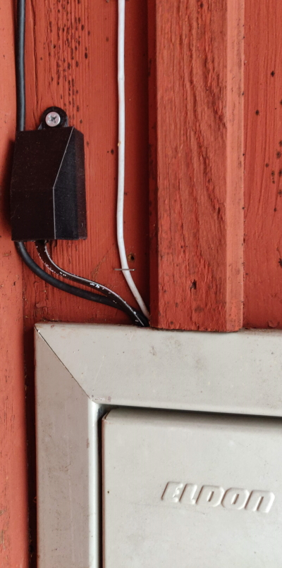
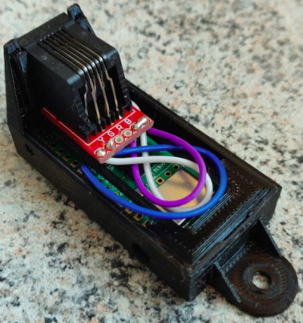
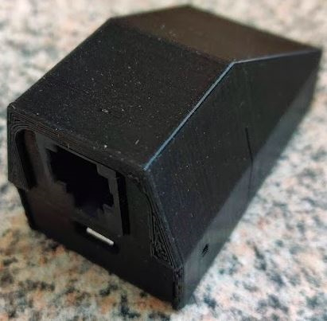

# 3D-printat chassi
Med hjälp av en 3D-skrivare kan ett chassi tillverkas, chassit är anpassat för delarna i [komponentlistan](https://github.com/HenrikSolver/picowhanport#komponentlista). Det består av tre delar som snäpps samman, ett inspektionshål gör att Picons LED-diod är synlig från chassits utsida.

<table>
  <tr>
    <td rowspan="2"></td>
    <td></td>
  </tr>
  <tr>
    <td></td>
  </tr>
</table>

## Tips
- [Komponentlistans](https://github.com/HenrikSolver/picowhanport#komponentlista) motstånd behöver lödas fast på undersidan av Picon för att hållaren (holder.stl) ska få plats.
- Bilden [print_positions.jpg](bilder/print_positions.jpg) visar hur modellerna ska vara vända vid utskrift, i .stl-filerna är modellerna vända som de visas i bilden.
- Modellerna base.stl och holder.stl kräver ingen support, för top.stl behövs endast lite support allra längst ned mot byggplattan.
- Eftersom top.stl har en så liten yta mot byggplattan kan extra fäste behövas vid utskrift, i Ultimaker Cura kan för den sakens skull tillägget [TabAntiWarping](https://marketplace.ultimaker.com/app/cura/plugins/5axes/TabAntiWarping) användas. Bilden [print_positions.jpg](bilder/print_positions.jpg) visar ett exempel på hur TabAntiWarping använts vid utskrift, se cirklarna med rutor i.
- Chassit i bilderna har skrivits ut i PETG, förmodligen fungerar PLA lika bra.